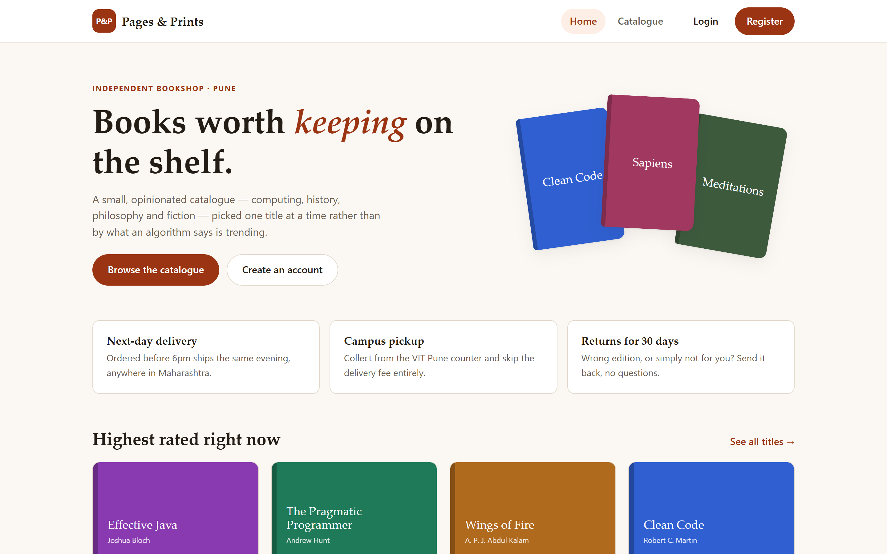
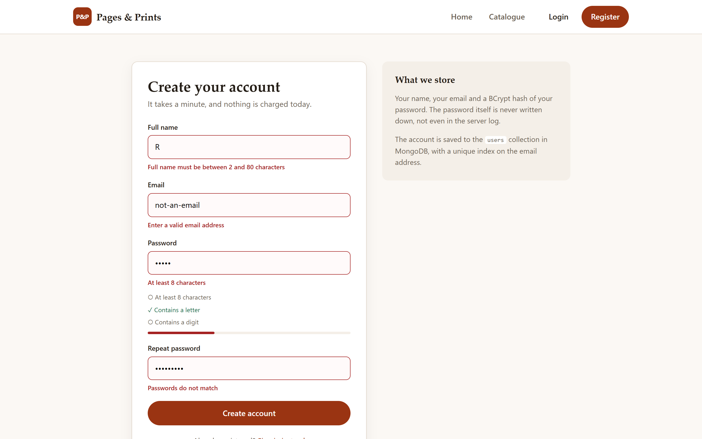
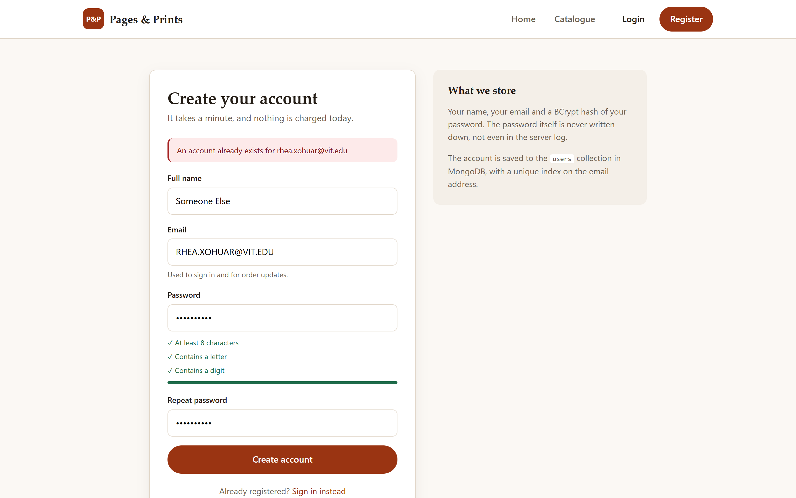
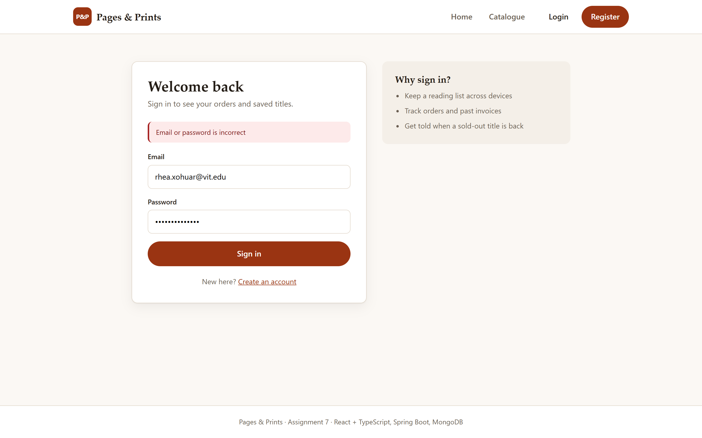
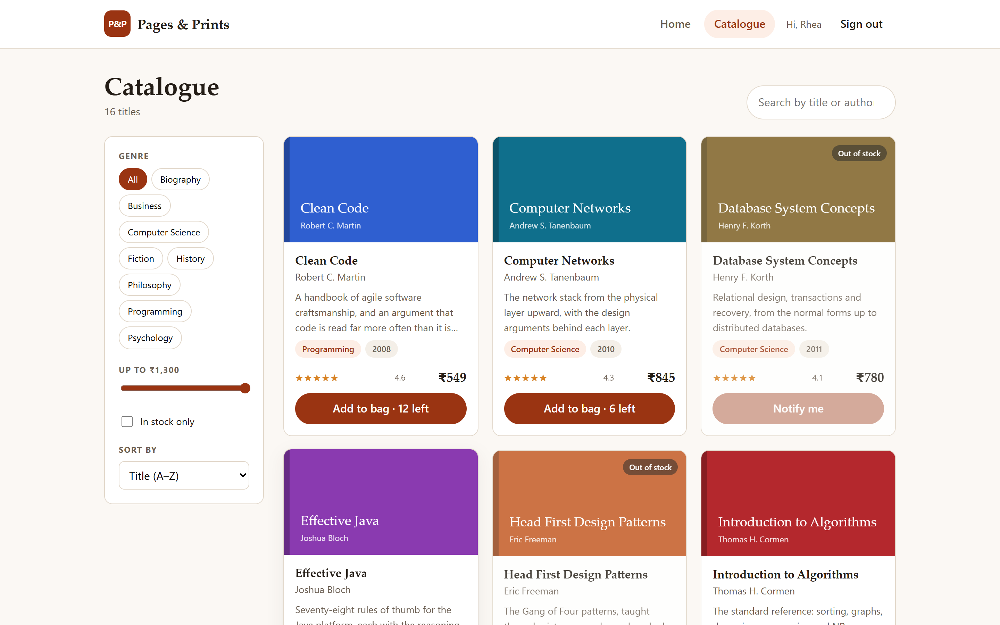
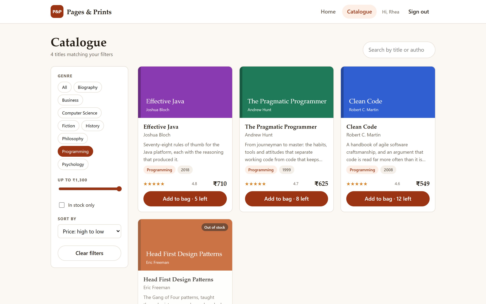
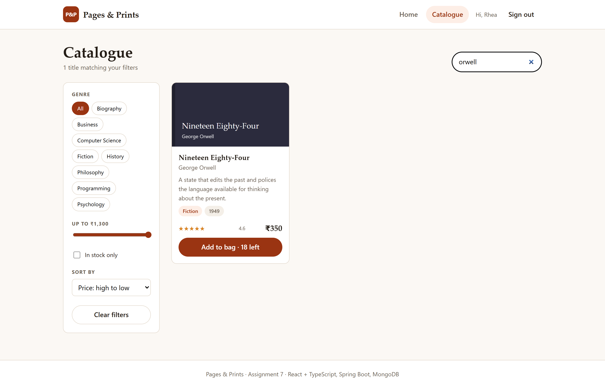
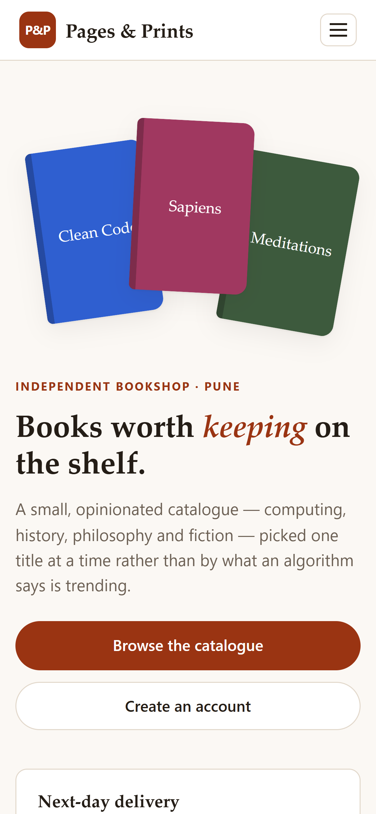
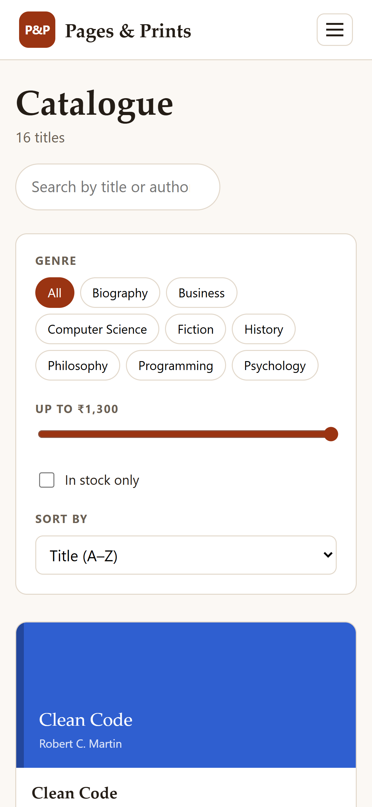
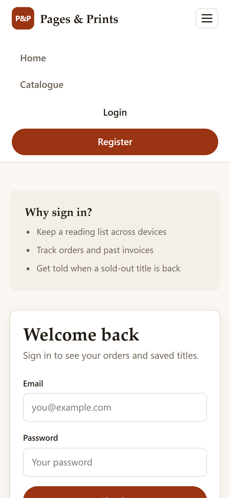

# Assignment 7 — Online Book Store using **React + TypeScript, Spring Boot, MongoDB**

> A three-tier book store. A React single page app written in TypeScript talks
> over REST to a Spring Boot service, which keeps the catalogue, the customer
> accounts and their login sessions in MongoDB.



## The four pages

| Page | Route | What it does |
| ---- | ----- | ------------ |
| **Home** | `/` | The shop front, the three service promises, and the four best-rated titles currently in stock, pulled live from the API |
| **Login** | `/login` | Signs an existing customer in and keeps them signed in across reloads |
| **Catalogue** | `/catalogue` | The whole catalogue with search, genre, price and stock filters, and five sort orders |
| **Registration** | `/register` | Creates an account in MongoDB, with the password rules enforced on both sides |

## Running it

Two terminals. The API first:

```bash
cd assign7_bookstore/backend
./mvnw spring-boot:run -Dspring-boot.run.profiles=embedded
```

The `embedded` profile starts a throwaway MongoDB, so nothing has to be
installed to try the app. To point it at a real server instead, drop the
profile and set `MONGODB_URI`:

```bash
set MONGODB_URI=mongodb://localhost:27017/vit_bookstore
./mvnw spring-boot:run
```

Then the UI:

```bash
cd assign7_bookstore/frontend
npm install
npm run dev          # http://localhost:5173
```

Vite proxies everything under `/api` to `http://localhost:8080`, so the browser
only ever talks to one origin in development and CORS never enters into it.

```bash
npm run build        # tsc -b, then the production bundle
npm run typecheck    # types only, no output
```

## The REST API

| Method | Path | Purpose |
| ------ | ---- | ------- |
| `GET` | `/api/books` | The catalogue. Takes `search`, `genre`, `maxPrice`, `inStockOnly`, `sort` |
| `GET` | `/api/books/{id}` | One title |
| `GET` | `/api/genres` | Distinct genres, for the filter list |
| `POST` | `/api/auth/register` | Create an account, returns a session |
| `POST` | `/api/auth/login` | Sign in, returns a session |
| `POST` | `/api/auth/logout` | Revoke the current token |
| `GET` | `/api/auth/me` | The signed-in customer, or 401 |

Every failure comes back in the same shape, so the React side has one error path:

```json
{
  "timestamp": "2026-09-12T16:21:16Z",
  "status": 400,
  "message": "Please correct the highlighted fields",
  "fieldErrors": { "email": "Enter a valid email address" }
}
```

`fieldErrors` is keyed by field name, which is exactly what the forms render
under each input.

## How accounts are stored

Three collections, each with a unique index created on startup:

| Collection | Unique on | Holds |
| ---------- | --------- | ----- |
| `books` | `isbn` | the catalogue |
| `users` | `email` | name, email, BCrypt hash, registration date |
| `sessions` | `token` | the issued token, its owner and its expiry |

A few decisions worth spelling out:

- **The password is never stored.** Only a BCrypt hash is written, and the
  response DTO has no field for it, so it cannot leak by accident.
- **A wrong password and an unknown email give the identical message.**
  Otherwise the login form doubles as a way to find out which addresses are
  registered.
- **Sessions live in Mongo, not in memory.** A restart does not silently sign
  everyone out, and a single token can be revoked by deleting one document.
- **The unique index is what actually decides a duplicate.** The service checks
  first for a friendly message, but it also catches `DuplicateKeyException`, so
  two simultaneous registrations for one address cannot both succeed.
- **The stored token is verified on load, not trusted.** `AuthContext` calls
  `/api/auth/me` on startup and discards a token the server no longer accepts.

## Validation

The rules are written twice on purpose — in the browser so the form answers
immediately, and in Bean Validation on the server so the rules hold regardless
of what reaches the API.

| Field | Rule |
| ----- | ---- |
| Full name | required, 2–80 characters |
| Email | required, valid address, not already registered |
| Password | required, at least 8 characters, at least one letter and one digit |
| Repeat password | must match — a browser-side idea, never sent to the API |



Every complaint the form can raise, raised at once. The password rules list
ticks live as you type, and the strength bar follows it.



Registering an address that already exists returns `409 Conflict`. The check is
case-insensitive, so `RHEA@vit.edu` collides with `rhea@vit.edu`.



A wrong password gives `401` and a message that deliberately does not say
whether the address exists.

## The catalogue



Sixteen titles across eight genres are seeded on first start. The seeder skips
any ISBN already stored, so restarting against a real MongoDB leaves existing
data alone.



Genre, a price ceiling, an in-stock toggle and five sort orders. Filtering runs
on the server; the text search is pushed down to Mongo as a regex query, with
the user's input escaped first so that searching for `C++` is a search rather
than a quantifier.



Search matches title or author, debounced by 250 ms so typing does not fire a
request per keystroke. Out-of-order responses are discarded, so a slow earlier
request cannot overwrite a newer result.

## Responsive layout

| | |
| --- | --- |
|  |  |

At 900 px the hero, the catalogue's filter rail and the auth pages each drop to
a single column. At 680 px the navigation collapses behind a toggle.



## Layout of the source

```
backend/
  src/main/java/com/vit/bookstore/
    model/          Book, User, Session          (@Document classes)
    repository/     Mongo repositories, incl. the regex search query
    service/        CatalogueService, AccountService, the exceptions
    web/            controllers, request/response records, error handler
    config/         CORS, and the catalogue seeder
  src/test/java/    CatalogueServiceTest
frontend/
  src/
    api/            types.ts, client.ts   (one place that calls the API)
    auth/           AuthContext.tsx       (who is signed in, app-wide)
    components/     NavBar, BookCard, Field
    pages/          HomePage, LoginPage, RegisterPage, CataloguePage
    App.tsx         routes
```

## Checks

- `./mvnw test` — 6 tests over the catalogue's filtering, sorting and regex
  escaping. All pass.
- `npm run build` — `tsc -b` under `strict`, with `noUnusedLocals`,
  `noUncheckedIndexedAccess` and `verbatimModuleSyntax`. No errors.
- The screenshots above were captured by driving the real app in a browser:
  registering a new account, being signed in, filtering, signing out, and being
  turned away with a wrong password.
