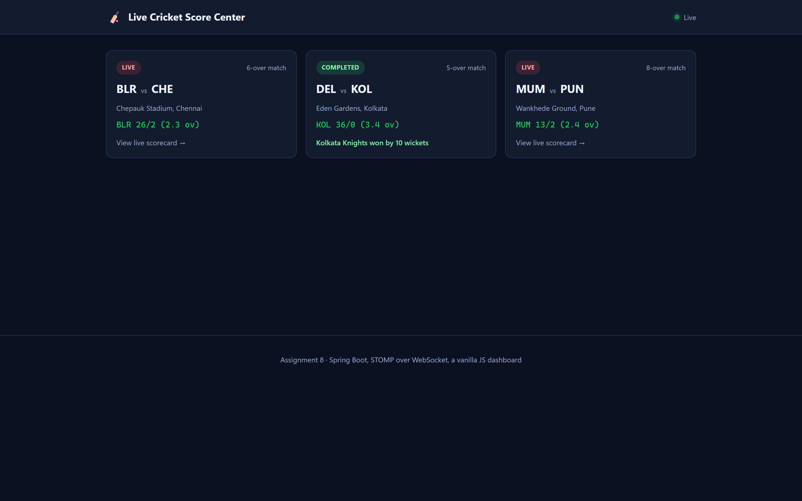
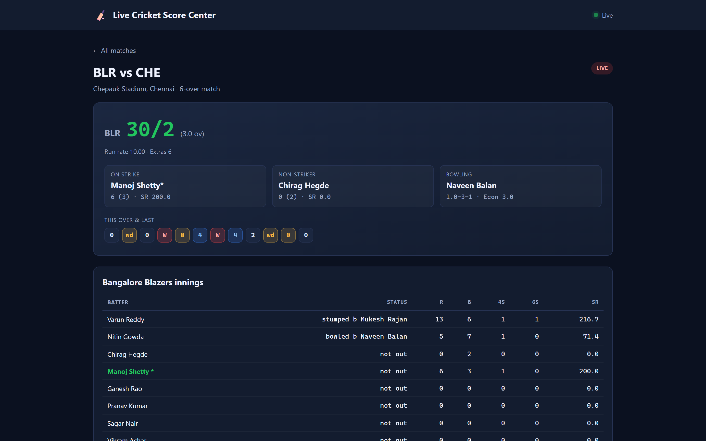
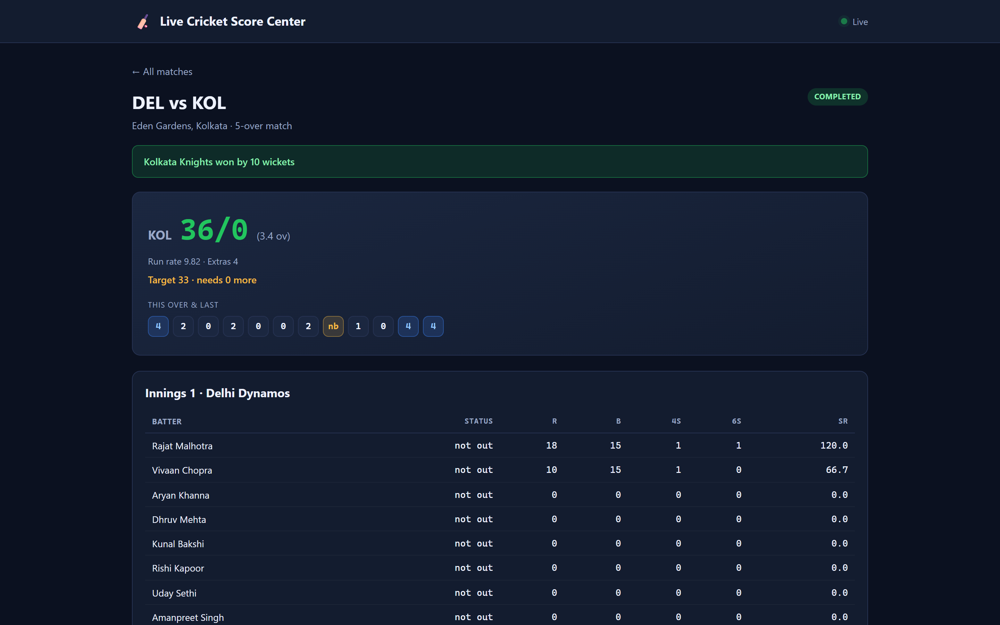
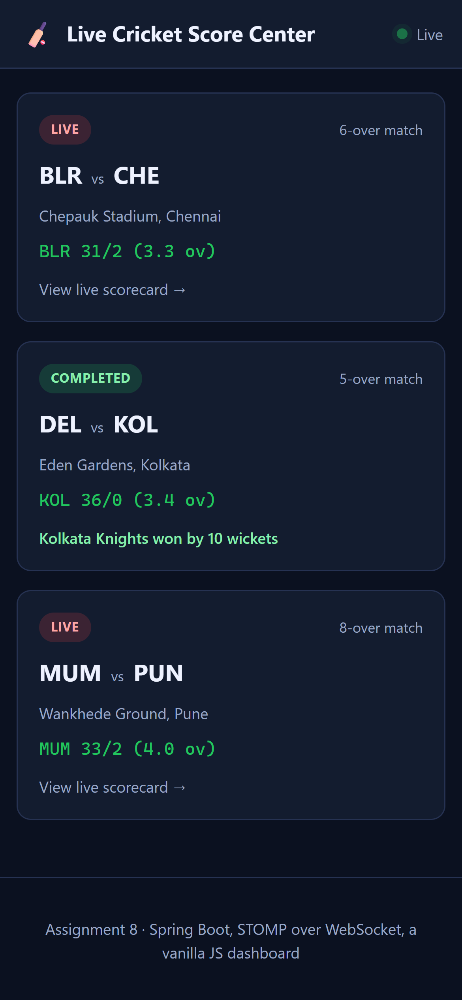
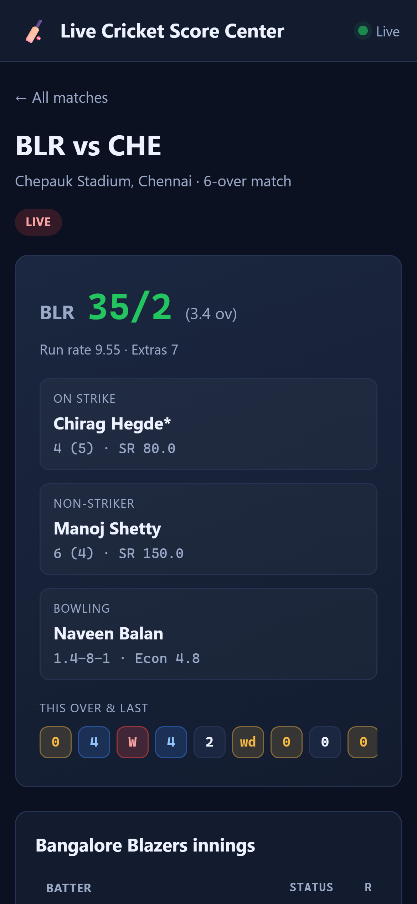

# Assignment 8 — Live Cricket Score Management System using **Spring Boot**

> One Spring Boot application. It simulates several cricket matches ball by
> ball, keeps every player's and every innings's figures as it goes, and
> pushes each delivery to a browser dashboard over WebSocket the moment it
> happens — with a REST API and an automatic polling fallback behind it.



## Running it

```bash
cd assign8_cricket/backend
./mvnw spring-boot:run
```

Then open **http://localhost:8080** — the dashboard is served by the same
Spring Boot application, so there is nothing else to start and no CORS to
configure. Three fixtures are seeded on startup: two begin live and play out
in real time, and one is fast-forwarded to a finished result immediately so
the match-summary view has something to show without a wait.

```bash
./mvnw test    # 9 tests over the scoring rules in Innings
```

## How the simulation works

A `MatchSimulationEngine` ticks every live match once every two seconds
(`@Scheduled(fixedRate = 2000)`). Each tick:

1. rolls one delivery's outcome — a dot, a run, a boundary, a wicket, a wide,
   a no-ball, a bye or a leg-bye, weighted so an over reads like cricket
   rather than a coin flip;
2. applies it to the batting team's `Innings`, which owns the rules a ball has
   to obey — who is on strike, when the strike rotates, what a wicket does to
   the batting order, when an over is complete;
3. rotates the bowler at the end of an over, never repeating the one who just
   bowled;
4. hands over to the second innings, or completes the match and works out the
   result, once an innings ends; and
5. broadcasts the fresh state to every subscriber.

```java
@Scheduled(fixedRate = 2000)
void tick() {
    for (Match match : matches.findAll()) {
        if (match.getStatus() == MatchStatus.COMPLETED) continue;
        simulateOneBall(match);
        broadcast(match);
    }
}
```

The same `simulateOneBall` step is what the startup seeder calls in a tight
loop to fast-forward the third fixture to a finished match — there is one
scoring engine, not two.

### What a delivery actually changes

`Innings.recordDelivery(...)` is the one place that has to get cricket's
smaller rules right:

- a **wide** or **no-ball** does not count as a legal ball, so the batter does
  not face it, but a no-ball still lets the batter score off it;
- **byes** and **leg-byes** add to the team total without being credited to
  the batter;
- the **strike rotates** on an odd run and automatically at the end of an
  over, but not on a wicket;
- a **wicket** brings in the next batter at the fallen batter's end and is
  recorded in the fall-of-wickets list;
- the innings ends on ten wickets, the overs running out, or — in the second
  innings — the target being passed.

This is exercised directly rather than only through the running simulation:

```java
@Test
void aNoBallCreditsTheBatterAndDoesNotCountAsLegal() {
    innings.recordDelivery(4, ExtraType.NO_BALL, 0, false, DismissalType.NOT_OUT);

    assertThat(innings.getTotalRuns()).isEqualTo(5);       // 1 for the no-ball + 4 struck
    assertThat(innings.getBallsInCurrentOver()).isZero();  // not a legal ball
    assertThat(innings.currentStriker().getRunsScored()).isEqualTo(4);
}
```

## Real-time delivery

`WebSocketConfig` opens a STOMP broker over SockJS at `/ws`. The dashboard
subscribes to:

- `/topic/matches` — the summary list, refreshed on every tick of every match;
- `/topic/matches/{id}` — one match's full detail, while its scorecard is open.

If the socket cannot connect — a proxy blocking the upgrade, for instance —
`app.js` notices within a couple of seconds and falls back to polling the same
REST endpoints every three seconds, switching back the moment the socket
comes up. The indicator in the header shows which one is active.

```
GET  /api/matches        the summary list
GET  /api/matches/{id}   one match's full detail: both innings, every
                          player's figures, the last twelve balls
```

The two transports return the same shapes on purpose (`Dtos.MatchSummary` and
`Dtos.MatchDetail`), so the dashboard's rendering code does not care which one
delivered a given update.

## The dashboard

Plain HTML, CSS and JavaScript — no build step, no framework — served
straight out of `src/main/resources/static`. A small hash router
(`#/` and `#/match/{id}`) switches between the two views without a page
reload.


The live scoreboard: current score, run rate, the chasing side's target once
there is one, who is on strike, who is bowling, and a ball-by-ball ticker.



Nothing on this page is re-fetched by the browser — every number changed
because a STOMP frame arrived.



Once a match finishes, the result banner replaces the live scoreboard and
both innings' full batting and bowling cards stay on the page. A finished
innings is frozen exactly as it stood — no batter is shown "on strike" once
the game has moved past them, which took a real fix during development (an
earlier version kept marking whoever was on strike when the *first* innings
ended, even after the second innings — or the whole match — had finished).

## Responsive layout

| | |
| --- | --- |
|  |  |

Below 720 px the striker/non-striker/bowler cards stack to one column, the
scoreboard's numerals shrink, and both scorecard tables scroll sideways
inside their own box rather than widening the page.

## Layout of the source

```
backend/src/main/java/com/vit/cricket/
  model/         Match, Innings, Player, Team, BallEvent, and the enums -
                 the domain, including the scoring rules on Innings
  simulation/    BallOutcomeGenerator (rolls one delivery),
                 MatchSimulationEngine (advances and broadcasts)
  repository/    MatchRepository - in-memory; nothing here needs to survive
                 a restart, this is a live feed, not an archive
  web/           Dtos, MatchMapper, MatchController - the REST + WS shapes
  config/        WebSocketConfig, FixtureFactory, MatchSeeder
backend/src/test/java/com/vit/cricket/model/
  InningsTest.java   9 tests over strike rotation, extras, wickets, overs
backend/src/main/resources/static/
  index.html, css/dashboard.css, js/app.js   the dashboard
```

## Checks

- `./mvnw test` — 9 tests over `Innings`, covering dot balls, strike
  rotation, wides, no-balls, byes, over completion, wickets, all-out and a
  chase reaching its target. All pass.
- The screenshots above were captured by driving the running application in a
  browser: opening the dashboard, watching a live match tick twice over its
  own WebSocket connection, and opening the pre-completed match's summary.
